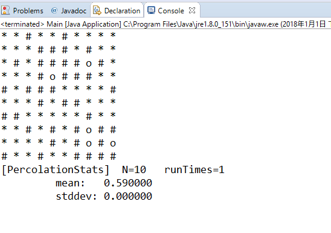
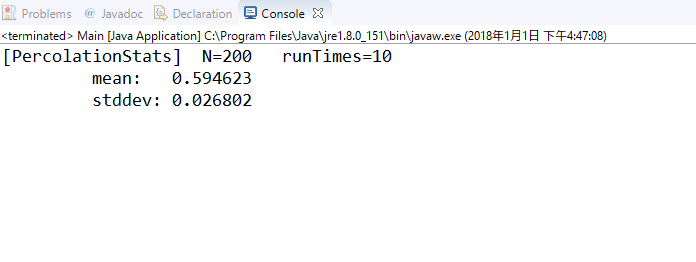
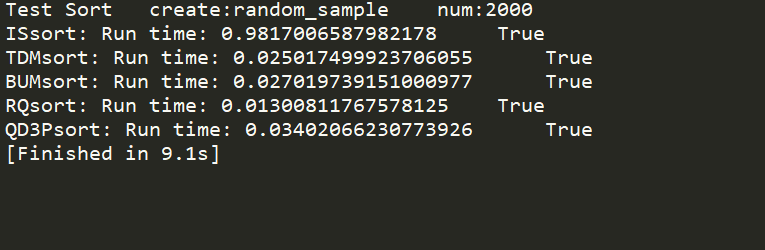
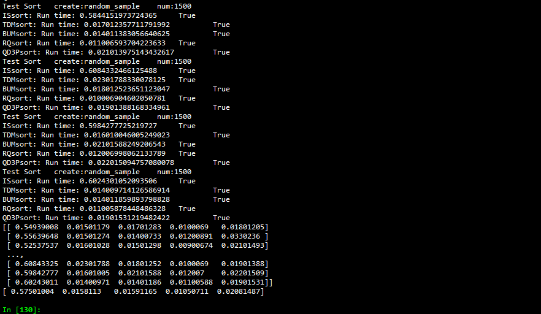
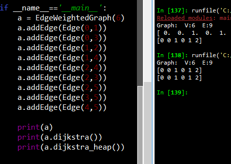
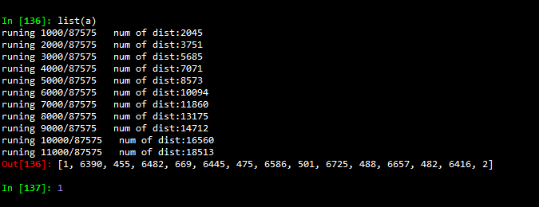

# **算法上机报告**

## **渗透问题（Percolation）**

### 问题描述

给定由随机分布的绝缘材料和金属材料构成的组合系统：金属材料占多大比例才能使组合系统成为电导体？ 给定一个表面有水的多孔景观（或下面有油），水将在什么条件下能够通过底部排出（或油渗透到表面）？ 科学家们已经定义了一个称为渗透（percolation）的抽象过程来模拟这种情况。

模型：我们使用 N×N 网格点来模型一个渗透系统。每个格点或是 open 格点或是 blocked 格点。一个 full site 是一个 open 格点，它可以通过一连串的邻近（左，右，上，下）open 格点连通到顶行的一个 open 格点。如果在底行中有一个 full site 格点，则称系统是渗透的。（对于绝缘/金属材料的例子，open 格点对应于金属材料，渗透系统有一条从顶行到底行的金属路径，且 fullsites 格点导电。对于多孔物质示例，open格点对应于空格，水可能流过，从而渗透系统使水充满 open 格点，自顶向下流动。）

问题：在一个著名的科学问题中，研究人员对以下问题感兴趣：如果将格点以概率p 独立地设置为 open 格点（因此以概率 1-p 被设置为 blocked 格点），系统渗透的概率是多少？ 当 p = 0 时，系统不会渗出; 当 p=1 时，系统渗透。 


当 N 足够大时，存在阈值p*，使得当 p <p*，随机 N× N 网格几乎不会渗透，并且当 p> p*时，随机 N× N 网格几乎总是渗透。 请编写一个计算机程序来估计 p* 

### 解决思路

解决此问题的一种方法是使用并查集算法，对所有可以连接上的节点进行union操作，用find操作来判断上下是否连通。采用加权树，路径压缩，虚拟节点等方法对其进行优化以后，达到一个可以接受的时间复杂度。为简便起见，在N*N的网格中额外添加两点，分别联通第一行和最后一行。使最终测试联通时只需测试这两点是否联通即可。
在测试程序中进行蒙特卡罗模拟
1.初始化所有格点为blocked
2.重复以下步骤，直到系统渗透：
在所有被阻止的站点中随机均匀地选择点（行i，列j）。
打开这个点（第i行，第j列）。
3.当系统渗透时根据打开点的个数来计算渗滤概率P。
4.通过重复该计算实验T次并对结果求平均值，我们获得了更准确的渗透阈值估计，计算出阈值的标准差和95%的置信区间。

### 解决方法
- API
```java
public class Percolation {
	private int N;//N*N的点
	private int[] uniondata;//一维数组保存的二维数据
	private boolean[] opendata;//true -> open ; false -> not open
	
	public void open(int i,int j);//使点联通
	public boolean isConnected();//测试整个系统是否联通
	public boolean isConnected(int i,int j);//测试顶部是否与（i，j）联通
	public boolean isOpen(int i,int j);//（i，j）是否开启
	public void print();//打印整个系统
	public Percolation(int N);//初始化
	public int openNum();//计算打开点的数量
	public double openPercent();//计算打开点占所有点的百分百
	private int find(int p);//并查集 查找
	private void union(int p, int q);//并查集 合并
	private int getFirstID();//获取顶部index
	private int getFinalID();//获取尾部index
	private int getID(int i,int j);//获取（i，j）index
}
```
- 主函数
```java
public class Main {
	public static void main(String[] args) {
		int N = 200;
		int runTimes = 100;				
		int[] runForOpenNums = PercolationStats(N, runTimes);
		System.out.printf("[PercolationStats]  N=%d   runTimes=%d\n",N,runTimes);
		System.out.printf("\t mean:   %f\n",mean(runForOpenNums,N,runTimes));
		System.out.printf("\t stddev: %f\n",stddev(runForOpenNums,N,runTimes));
	}

	private static int runOneTime(int N) {
		Percolation temp = new Percolation(N);
		Random rand = new Random();
		while(!temp.isConnected()) {
			temp.open(rand.nextInt(N)+1, rand.nextInt(N)+1);// range(1,N+1)
		}
		return temp.openNum();
	}
	public static int[] PercolationStats(int N, int runTimes) {//运行
		int[] runForOpenNums = new int[runTimes];
		for(int i = 0;i<runTimes;i++) {
			runForOpenNums[i] = runOneTime(N);
		}
		return runForOpenNums;
	}
	public static int sum(int[] nums, int runTimes) {}//总数
	public static double mean(int[] runForOpenNums, int N, int runTimes) {...}// 平均值
	public static double stddev(int[] runForOpenNums, int N, int runTimes) {...}// 标准差
	
}
```
### 执行结果
- 调用print输出系统实时信息
  
- 多次运行结果
  

## 几种排序算法的实验性能比较

### 问题描述

实现插入排序（Insertion Sort，IS），自顶向下归并排序（Top-down Mergesort，TDM）， 自底向上归并排序（Bottom-up Mergesort，BUM），随机快速排序（Random Quicksort， RQ），Dijkstra 3-路划分快速排序（Quicksort with Dijkstra 3-way Partition，QD3P）。在你的计算机上针对不同输入规模数据进行实验，对比上述排序算法的时间及空间占用性能。要求对于每次输入运行 10 次，记录每次时间/空间占用，取平均值。 

### 解决思路

分别实现插入排序（Insertion Sort，IS），自顶向下归并排序（Top-down Mergesort，TDM）， 自底向上归并排序（Bottom-up Mergesort，BUM），随机快速排序（Random Quicksort， RQ），Dijkstra 3-路划分快速排序（Quicksort with Dijkstra 3-way Partition，QD3P）等算法。
并通过随机数产生一个随机数组，分别测试不同算法排序的时间。

### 实现函数接口

```python

defaultfunc = lambda x,y:x<y # 比较大小的函数（升序降序或其他）

def exch(data,i,j):# 交换列表的两个元素
def isSorted(data,func =defaultfunc):# 测试列表是否已排好序

# Insertion Sort 插入排序
def ISsort(data,func=defaultfunc):

# TDM 自顶向下归并排序
def TDMsort(data,func=defaultfunc):
def _Merge(data, aux, lo:int, mid:int, hi:int, func=defaultfunc):# 合并
def _TDMsort(data, aux, lo:int, hi:int, func=defaultfunc):

# BUM 自底向上归并排序
def BUMsort(data,func = defaultfunc):

# RQ 随机快速排序
def _partition(data,lo:int,hi:int,func = defaultfunc): # 分割
def _RQsort(data,lo:int,hi:int,func = defaultfunc):
def RQsort(data,func = defaultfunc):

# QD3P Dijkstra 3-路划分快速排序
def QD3Psort(data,func = defaultfunc):
def _QD3Psort(data,lo:int,hi:int,func = defaultfunc):
    
# test
class TestSort():
    def __init__(self):       
        self.sortfunc = {
            'ISsort':ISsort,
            'TDMsort':TDMsort,
            'BUMsort':BUMsort,
            'RQsort':RQsort,
            'QD3Psort':QD3Psort,
            # 'sorted':sorted,
        } 
        self.isSorted = isSorted     
    def testAll(self, num = 1500,randomfunc = np.random.random):# 测试所有排序算法
           
    def test(self,data,func):
```
### 实验结果

- 单次排序，对2000数据排序结果
  
- 10次排序取平均值
  
  实现插入排序（Insertion Sort，IS），自顶向下归并排序（Top-down Mergesort，TDM）， 自底向上归并排序（Bottom-up Mergesort，BUM），随机快速排序（Random Quicksort， RQ），Dijkstra 3-路划分快速排序（Quicksort with Dijkstra 3-way Partition，QD3P）

| 插入排序           | 自顶向下归并          | 自底向上归并排序        | 随机快速排序           | Dijkstra 3-路划分快速排序 |
| -------------- | --------------- | --------------- | ---------------- | ------------------ |
| 0.549390077591 | 0.0150117874146 | 0.017012834549  | 0.0100069046021  | 0.018012046814     |
| 0.556396484375 | 0.0150127410889 | 0.0140073299408 | 0.0120089054108  | 0.0330235958099    |
| 0.525375366211 | 0.0160102844238 | 0.0150129795074 | 0.00900673866272 | 0.0210149288177    |
| 0.641455411911 | 0.0140109062195 | 0.016010761261  | 0.0100069046021  | 0.0210149288177    |
| 0.571409225464 | 0.0140097141266 | 0.0130088329315 | 0.0090069770813  | 0.0160112380981    |
| 0.512367486954 | 0.0140075683594 | 0.0170121192932 | 0.0110082626343  | 0.018013715744     |
| 0.584415197372 | 0.0170123577118 | 0.0140113830566 | 0.0110065937042  | 0.0210139751434    |
| 0.608433246613 | 0.0230178833008 | 0.0180125236511 | 0.0100069046021  | 0.0190138816833    |
| 0.598427772522 | 0.0160100460052 | 0.0210158824921 | 0.0120069980621  | 0.0220150947571    |
| 0.602430105209 | 0.0140097141266 | 0.0140118598938 | 0.0110058784485  | 0.0190153121948    |

- 均值
| 插入排序       | 自顶向下归并    | 自底向上归并排序   | 随机快速排序     | Dijkstra 3-路划分快速排序 |
| ---------- | --------- | ---------- | ---------- | ------------------ |
| 0.57501004 | 0.0158113 | 0.01591165 | 0.01050711 | 0.02081487         |


## **地图路由（Map Routing）**

###  问题描述

实现经典的Dijkstra最短路径算法，并对其进行优化。这种算法广泛应用与地理信息系统，包括MapQuest和基于GPS的汽车导航系统。

### 解决思路

Dijkstra算法是最短路径问题的经典解决方案。对于图中的每个顶点，维护从源点到该顶点的最短已知的路径长度，并且将这些长度保持在一个数组中。初始时，把所有的顶点放在数组中，并设置高优先级，然后将源点的优先级设为0.0。算法通过从数组中取出最低优先级的顶点，然后检查可从该顶点经由一条边可达的所有顶点，以查看这条边是否提供了从源点到那个顶点较之之前已知的最短路径的更短路径。如果时这样，它会降低优先级来反映这种新的信息。可以采用优先队列，Astar算法来优化算法。

### 解决方法

因为稀疏矩阵，故采用邻接表储存图：

- 边的定义如下
```python
class Edge():
    def __init__(self, v = None, w = None, weight = 1):
        self.weight = weight# 权重
        self.v = v # 一条边
        self.w = w # 另一条边
    def either(self):# 返回边的两个节点
        return self.v,self.w
    def other(self,v):# 返回另一个节点
        if v==self.v:
            return self.w
        elif v==self.w:
            return self.v
        else:
            raise ValueError("V:{} not in this edge.",v)
    def __str__(self):
        return '{} <-- {} --> {}'.format(self.v,self.weight,self.w)
    def __lt__(self,edge):# 操作符重载，对边的大小比较为边的权重比较
        return self.weight < edge.weight
    def __eq__(self,edge):
        return self.weight == edge.weight        
    def __gt__(self,edge):
        return self.weight > edge.weight
```
- 图的定义如下
```python
class EdgeWeightedGraph():
    def __init__(self,V):
        self.V = V # 节点个数
        self.E = 0 # 边的数量
        self.adj = [] # 邻接表
        for i in range(V):# 邻接表初始化
            self.adj.append([])
    def addEdge(self,edge):# 添加边
        v,w = edge.either()
        self.adj[v].append(edge)
        self.adj[w].append(edge)
        self.E += 1
    def edges(self):# 输出图的所有边
        for i in range(self.V):
            for edge in self.adj[i]:
                if edge.other(i)>i:
                    yield edge
    def toNxGraph(self):# 将自己的图类，转换为python自带的图类型
        g = nx.Graph() 
        for edge in self.edges():
            g.add_edge(*edge.either(),weight=edge.weight)   
        return g  
    def draw(self):# 画图
        nx.draw(self.toNxGraph())
    def min_path(self,v,w):# 最短路径
        pass    

    def _dijkstra_heap_end(self,v = 0,endv = None):# 截断堆优化后的迪杰斯特拉算法
    	pass
    	
    def dijkstra_heap(self,v = 0):# 堆优化后的迪杰斯特拉算法
		pass

    def dijkstra(self,v=0):# 迪杰斯特拉算法
		pass

    def __str__(self):
        return 'Graph:  V:{}  E:{}'.format(self.V,self.E)
```
对迪杰斯特拉的优化采用了两种方法：
- 使用更快的优先队列。在提供的优先队列中有一些优化空间
- 一旦计算到两点之间距离后就终止

### 实验结果
- 传统迪杰斯特拉算法和堆优化后算法对少量数据的计算



- 少量数据作图分析


- 地图数据计算节点1到节点2 的最短路径




## 附录

### 问题一源码
- Percolation.java

```java
package question1;

public class Percolation {
	private int N;
	private int[] uniondata;
	private boolean[] opendata;//true -> open ; false -> not open
	public Percolation(int N) {
		this.N = N;	
		this.uniondata = new int[N*N+2];
		this.opendata = new boolean[N*N+2];
		for(int i=0; i<N*N+2; i+=1) {
			this.uniondata[i] = i;
			this.opendata[i] = false;
		}
		this.opendata[getFirstID()] = true;
		this.opendata[getFinalID()] = true;
	}
	
	
	private int find(int p) {
		while(p != uniondata[p])p = uniondata[p];
		return p;
	}

	private void union(int p, int q) {
		int pRoot = find(p);
		int qRoot = find(q);
		if(pRoot == qRoot) return;
		uniondata[pRoot] = qRoot;
	}
	
	public void open(int i,int j) {
		if(isOpen(i,j) == false) {
			opendata[getID(i,j)] = true;
			if(i - 1 == 0) {
				union(getID(i,j), getFirstID());
			}
			if(i == N){
				union(getID(i,j), getFinalID());
			}
			if(i + 1 <= N)
				if(isOpen(i+1,j))
					union(getID(i,j), getID(i+1,j));			
			if(i - 1 >= 1)
				if(isOpen(i-1,j))
					union(getID(i,j), getID(i-1,j));
			
			if(j + 1 <= N)
				if(isOpen(i,j+1))
					union(getID(i,j), getID(i,j+1));	
			if(j - 1 >= 1)
				if(isOpen(i,j-1))
					union(getID(i,j), getID(i,j-1));			
		}
	}
	
	public boolean isConnected() {
		return find(getFirstID()) == find(getFinalID());
	}
	public boolean isConnected(int i,int j) {
		return find(getFirstID()) == find(getID(i,j));
	}
	public boolean isOpen(int i,int j) {
//		System.out.printf("i:%d j:%d   id:%d\n",i,j,getID(i,j));
		return opendata[getID(i,j)];
	}
	public void print() {
		for(int i = 1; i <= N; i++) {
			for(int j = 1; j <= N; j++) {
				if(isConnected(i,j)) {
					System.out.printf("* ");
				}else if(isOpen(i,j)) {
					System.out.printf("o ");
				}else{
					System.out.printf("# ");
				}	
			}
			System.out.printf("\n");
		}
	}
	private int getFirstID() {
		return 0;
	}
	private int getFinalID() {
		return N*N+2-1;
	}	
	public int openNum() {
		int opencount = 0;
		for(int i=1;i<=N;i++) {
			for(int j=1;j<=N;j++) {
				if(isOpen(i,j)) {
					opencount += 1;		
				}			
			}
		}
		return 	opencount;	
	}
	public double openPercent() {
		int opencount = 0;
		for(int i=1;i<=N;i++) {
			for(int j=1;j<=N;j++) {
				if(isOpen(i,j)) {
					opencount += 1;		
//					System.out.println("??");
				}			
			}
		}
		return (double)(opencount)/(double)(N*N);
	}
	private int getID(int i,int j) {
		return (i-1)*N+j;
	}	
//	private int getUnion(int id) {
//		return find(id);
//	}		
}
```

- Main.java

```java
package question1;

import java.util.*;
import java.math.*;

public class Main {

	public static void main(String[] args) {
		int N = 10;
		int runTimes = 1;				
		int[] runForOpenNums = PercolationStats(N, runTimes);
		System.out.printf("[PercolationStats]  N=%d   runTimes=%d\n",N,runTimes);
		System.out.printf("\t mean:   %f\n",mean(runForOpenNums,N,runTimes));
		System.out.printf("\t stddev: %f\n",stddev(runForOpenNums,N,runTimes));
	}

	private static int runOneTime(int N) {
		Percolation temp = new Percolation(N);
		Random rand = new Random();
		while(!temp.isConnected()) {
			temp.open(rand.nextInt(N)+1, rand.nextInt(N)+1);// range(1,N+1)
		}
		temp.print();
		return temp.openNum();
	}
	public static int[] PercolationStats(int N, int runTimes) {
		int[] runForOpenNums = new int[runTimes];
		for(int i = 0;i<runTimes;i++) {
			runForOpenNums[i] = runOneTime(N);
		}
		return runForOpenNums;
	}
	public static int sum(int[] nums, int runTimes) {
		int sumn = 0;
		for(int i=0;i<runTimes;i++) {
			sumn += nums[i];
		}
		return sumn;
	}
	public static double mean(int[] runForOpenNums, int N, int runTimes) {
		return (double)sum(runForOpenNums,runTimes)/(double)(runTimes*N*N);
	}
	public static double stddev(int[] runForOpenNums, int N, int runTimes) {
		double mean = mean(runForOpenNums, N, runTimes);
		double temp = 0;
		for(int i=0; i<runTimes;i++) {
			temp += Math.abs(mean - runForOpenNums[i]/(double)(N*N));
		}
		return Math.sqrt(temp)/runTimes;
	}
	
}
```
### 问题二源码

- sortd.py

```python
import random
import numpy as np
from time import time
# import unittest
from memory_profiler import profile

defaultfunc = lambda x,y:x<y

def exch(data,i,j):
    a = data[i]
    data[i] = data[j]
    data[j] = a

def isSorted(data,func =defaultfunc):
    N = len(data)
    for i in range(1,N):
        if not func(data[i-1],data[i]):
            return False
    return True

# Insertion Sort
def ISsort(data,func=defaultfunc):
    N = len(data)
    for i in range(1,N):
        for j in range(i,0,-1):
            if func(data[j-1],data[j]):
                break
            exch(data,j,j-1) 

# TDM
def TDMsort(data,func=defaultfunc):
    N = len(data)
    aux = data.copy()
    _TDMsort(data,aux,0,N-1,func)

def _Merge(data, aux, lo:int, mid:int, hi:int, func=defaultfunc):
    for k in range(lo, hi + 1):
        aux[k] = data[k]
    i, j = lo, mid + 1
    for k in range(lo, hi + 1):
        if i > mid:
            data[k] = aux[j]
            j += 1
        elif j > hi:
            data[k] = aux[i]
            i += 1
        elif func(aux[j],aux[i]):
            data[k] = aux[j]
            j += 1
        else:
            data[k] = aux[i]
            i += 1

def _TDMsort(data, aux, lo:int, hi:int, func=defaultfunc):
    if lo >= hi:
        return
    mid = int(lo + (hi-lo)/2)
    _TDMsort(data,aux,lo,mid,func)
    _TDMsort(data,aux,mid+1,hi,func)
    _Merge(data,aux,lo,mid,hi,func)

# BUM
def BUMsort(data,func = defaultfunc):
    aux = data.copy()
    N = len(data)
    sz = 1
    while sz < N:
        lo = 0
        while lo < N - sz:
            _Merge(data,aux,lo,lo+sz-1,min(lo+sz+sz-1,N-1),func)
            lo += sz + sz
        sz += sz


# RQ
def _partition(data,lo:int,hi:int,func = defaultfunc):
    i,j,v = lo,hi+1,data[lo]
    while True:
        i += 1
        while func(data[i],v):
            if i==hi:
                break
            i += 1
        j -= 1
        while func(v,data[j]):
            if j==lo:
                break
            j -= 1
        if(i>=j):
            break
        exch(data,i,j)
    exch(data,lo,j)
    return j


def _RQsort(data,lo:int,hi:int,func = defaultfunc):
    if(hi<=lo):
        return 
    cut = _partition(data,lo,hi,func)
    _RQsort(data,lo,cut-1)   
    _RQsort(data,cut+1,hi) 

def RQsort(data,func = defaultfunc):
    random.shuffle(data)
    _RQsort(data,0,len(data)-1,func)


# QD3P
def QD3Psort(data,func = defaultfunc):
    random.shuffle(data)
    _QD3Psort(data,0,len(data)-1,func)

def _QD3Psort(data,lo:int,hi:int,func = defaultfunc):
    if(hi<=lo):
        return 
    lt,i,gt,v = lo,lo + 1,hi,data[lo]
    while i<=gt:
        if func(data[i],v):
            exch(data,lt,i)
            lt += 1
            i += 1
        elif func(v,data[i]):
            exch(data,i,gt)
            gt -= 1
        else:
            i += 1
    _QD3Psort(data,lo,lt-1,func)
    _QD3Psort(data,gt+1,hi,func)     


# test
class TestSort():
    def __init__(self):       
        self.sortfunc = {
            'ISsort':ISsort,
            'TDMsort':TDMsort,
            'BUMsort':BUMsort,
            'RQsort':RQsort,
            'QD3Psort':QD3Psort,
            # 'sorted':sorted,
        } 
        self.isSorted = isSorted     

    def testAll(self, num = 1500,randomfunc = np.random.random):
        data = randomfunc(num)
        print("Test Sort   create:{}    num:{} ".format(randomfunc.__name__,num))
        r = []
        for funcname in self.sortfunc:
            r.append(self.test(data,self.sortfunc[funcname]))
        return r
           
    def test(self,data,func):
        data = data.copy()
        time1 = time()
        func(data)
        time2 = time()
        print("{}: Run time: {} \t {}".format(func.__name__, time2-time1,self.isSorted(data)))
        return time2-time1

    def test_for10(self):
        r = []
        for i in range(10):
            r.append(self.testAll())
        r = np.array(r)
        print(r)
        print(np.mean(r,0))
        return r
    
test = TestSort()
test.testAll(num = 2000,randomfunc=np.random.random)

```

### 问题三代码

- main.py

```python
import networkx as nx
import numpy as np
import heapq


class Edge():
    def __init__(self, v = None, w = None, weight = 1):
        self.weight = weight
        self.v = v
        self.w = w
    def either(self):
        return self.v,self.w
    def other(self,v):
        if v==self.v:
            return self.w
        elif v==self.w:
            return self.v
        else:
            raise ValueError("V:{} not in this edge.",v)
    def __str__(self):
        return '{} <-- {} --> {}'.format(self.v,self.weight,self.w)
    def __lt__(self,edge):
        return self.weight < edge.weight
    def __eq__(self,edge):
        return self.weight == edge.weight        
    def __gt__(self,edge):
        return self.weight > edge.weight 


class EdgeWeightedGraph():
    def __init__(self,V):
        self.V = V
        self.E = 0
        self.adj = []
        for i in range(V):
            self.adj.append([])
    def addEdge(self,edge):
        v,w = edge.either()
        self.adj[v].append(edge)
        self.adj[w].append(edge)
        self.E += 1
    def edges(self):
        for i in range(self.V):
            for edge in self.adj[i]:
                if edge.other(i)>i:
                    yield edge
    def toNxGraph(self):
        g = nx.Graph() 
        for edge in self.edges():
            g.add_edge(*edge.either(),weight=edge.weight)   
        return g  
    def draw(self):
        nx.draw(self.toNxGraph())
    def min_path(self,v,w):
        prev = self._dijkstra_heap_end(w,v)
        if prev[v]==-1:
            return None
        yield v
        while not v == prev[v]: 
            v = prev[v]
            yield v
    def _dijkstra_heap_end(self,v = 0,endv = None):
        if not endv:
            return dijkstra_heap(v)
        S = np.ones(self.V) * False
        dist = []
        heapq.heappush(dist,(0,v))
        prev = np.ones(self.V,'int32') * -1
        prev[v] = v
        S[v] = True
        for edge in self.adj[v]:# init
            w = edge.other(v)
            heapq.heappush(dist,(edge.weight, w))
            prev[w] = v
        for i in range(1,self.V):
            if(i%1000==0):
                print('runing {}/{}   num of dist:{}'.format(i,self.V,len(dist)))
            if not dist:
                break
            u = v
            minv = heapq.heappop(dist)
            while S[minv[1]]:
                try:
                    minv = heapq.heappop(dist)
                except IndexError:
                    return prev
            u = minv[1]
            if u == endv:
                return prev            
            S[u] = True
            for edge in self.adj[u]:# change dist
                w = edge.other(u)
                e = False
                for i,(weight,distv) in enumerate(dist):
                    if w == distv:
                        e = True
                        if weight > edge.weight:
                            del dist[i]
                            heapq.heappush(dist,(edge.weight, w))
                            prev[w] = u  
                        break
                if not S[w] and not e:
                    heapq.heappush(dist,(edge.weight, w))
                    prev[w] = u 
        return prev

    def dijkstra_heap(self,v = 0):
        S = np.ones(self.V) * False
        dist = []
        heapq.heappush(dist,(0,v))
        prev = np.ones(self.V,'int32') * -1
        prev[v] = v
        S[v] = True
        for edge in self.adj[v]:# init
            w = edge.other(v)
            heapq.heappush(dist,(edge.weight, w))
            prev[w] = v
        for i in range(1,self.V):
            if(i%1000==0):
                print('runing {}/{}   num of dist:{}'.format(i,self.V,len(dist)))
            if not dist:
                break
            u = v
            minv = heapq.heappop(dist)
            while S[minv[1]]:
                try:
                    minv = heapq.heappop(dist)
                except IndexError:
                    return prev
            u = minv[1]
            S[u] = True
            for edge in self.adj[u]:# change dist
                w = edge.other(u)
                e = False
                for i,(weight,distv) in enumerate(dist):
                    if w == distv:
                        e = True
                        if weight > edge.weight:
                            del dist[i]
                            heapq.heappush(dist,(edge.weight, w))
                            prev[w] = u  
                        break
                if not S[w] and not e:
                    heapq.heappush(dist,(edge.weight, w))
                    prev[w] = u 
        return prev

    def dijkstra(self,v=0):
        S = np.ones(self.V) * False
        dist = np.ones(self.V) * np.inf
        prev = np.ones(self.V,'int32') * -1   
        dist[v] = 0 
        prev[v] = v
        S[v] = True
        for edge in self.adj[v]:# init
            w = edge.other(v)
            dist[w] = edge.weight
            prev[w] = v
        for i in range(1,self.V):
            if(i%100==0):
                print('runing {}/{}'.format(i,self.V))
            mindist = np.inf
            u = v
            for j in range(1,self.V):# find the next V for min dist
                if not S[j] and dist[j] < mindist:
                    u = j
                    mindist = dist[j]
            S[u] = True
            for edge in self.adj[u]:# change dist
                w = edge.other(u)
                if dist[w] > edge.weight:
                    dist[w] = edge.weight
                    prev[w] = u  
        return prev

    def __str__(self):
        return 'Graph:  V:{}  E:{}'.format(self.V,self.E)


if __name__=='__main__':
    a = EdgeWeightedGraph(6)
    a.addEdge(Edge(0,1))
    a.addEdge(Edge(0,3))
    a.addEdge(Edge(1,2))
    a.addEdge(Edge(1,4))
    a.addEdge(Edge(2,4))
    a.addEdge(Edge(2,3))
    a.addEdge(Edge(2,5))
    a.addEdge(Edge(3,5))
    a.addEdge(Edge(4,5))
    
    print(a)
    print(a.dijkstra())
    print(a.dijkstra_heap())

```

